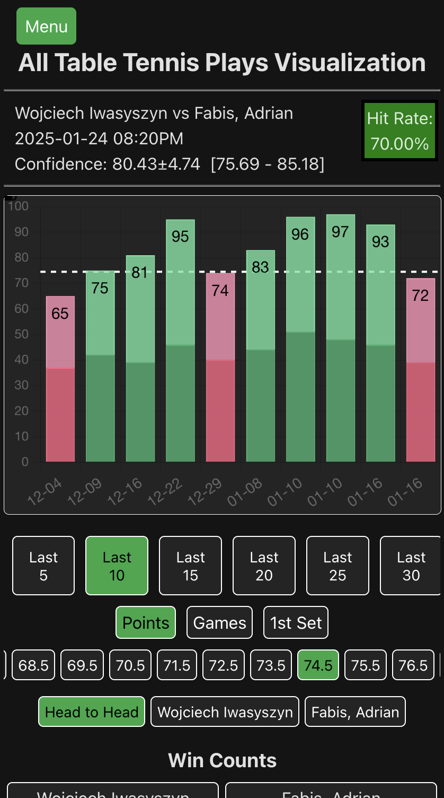
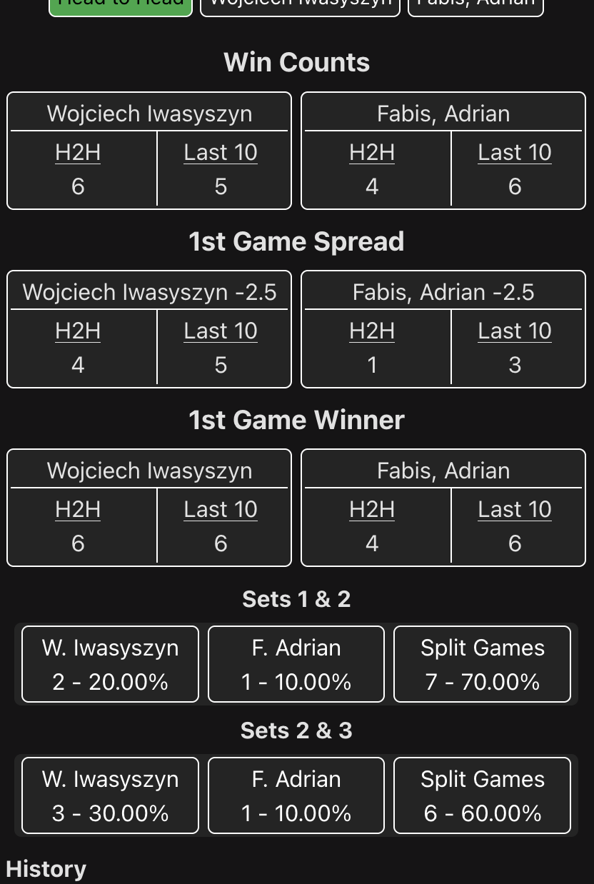
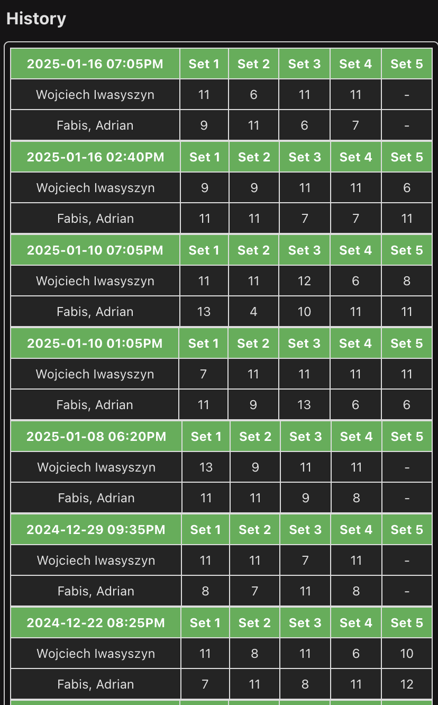
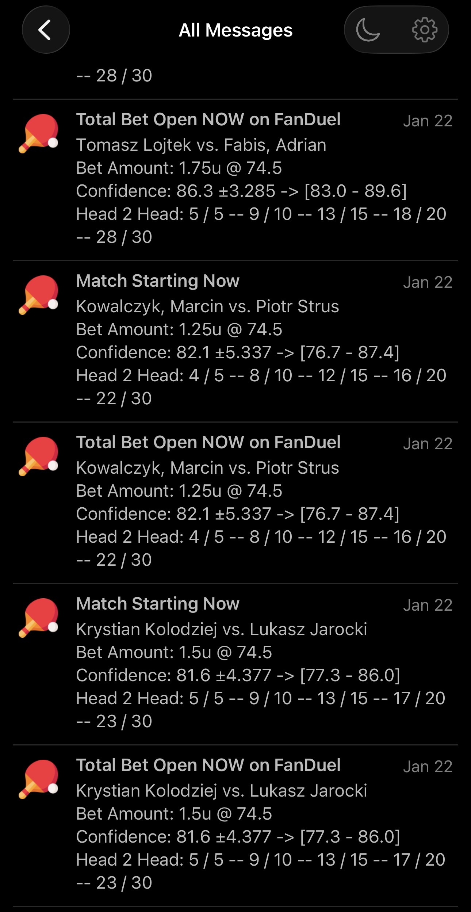
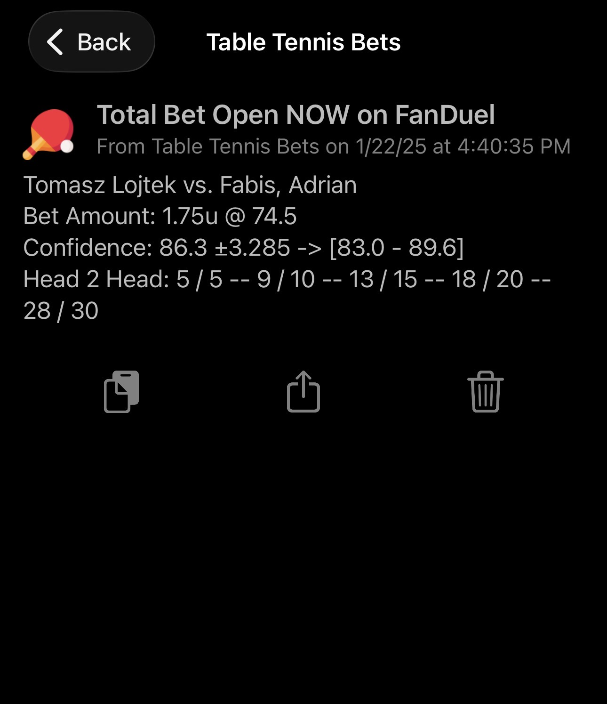

# Table Tennis Bet Scraper

## Project Status

This personal project has been archived and is no longer being updated.

It was built as a side project to analyze TT Elite Series table tennis matches and identify heavily favored matchups for betting opportunities. Development stopped after FanDuel flat-bet limited my account to a $10 maximum, which made bet-sizing increases on high-probability matches no longer profitable.

## Overview

This project scraped match data, modeled confidence for betting angles, and generated recommendation outputs for:

- Betting unit size
- Target over/under point total
- Match confidence interval (used as the baseline recommendation filter)

The core data processing scripts were written in Python, with outputs saved to CSV/JSON for review and visualization.

## What It Did

- Collected and parsed TT Elite Series match data from web sources
- Filtered upcoming events and focused on heavily favored matchups
- Calculated confidence metrics per match to rank or exclude plays
- Produced structured recommendation outputs for unit sizing and totals targets
- Sent Pushover alerts to mobile when matches were opening (typically 30-45 minutes before start)
- Powered a mobile-friendly web app for viewing results

## Example Screenshots

### Mobile Web App

<table>
	<tr>
		<td></td>
		<td style="padding-left: 16px; vertical-align: top;">Main bar chart table with confidence stats and hit rate</td>
	</tr>
	<tr>
		<td></td>
		<td style="padding-left: 16px; vertical-align: top;">Added numerical stats for additional bet options like 1st game, and set winner</td>
	</tr>
	<tr>
		<td></td>
		<td style="padding-left: 16px; vertical-align: top;">full history table with set/match scores</td>
	</tr>
</table>

### Pushover Notifications

<table>
	<tr>
		<td></td>
		<td style="padding-left: 16px; vertical-align: top;">Notification list that was being pushed to my phone</td>
	</tr>
	<tr>
		<td></td>
		<td style="padding-left: 16px; vertical-align: top;">individual notification for an upcoming match</td>
	</tr>
</table>

## Stack

- Python data scripts for scraping and recommendation logic
- CSV/JSON output artifacts for downstream analysis and UI
- Frontend app (Vite/React + TypeScript) for visualization
- Docker scripts for running jobs in a containerized workflow
- Pushover API integration for match notifications

## Repository Layout

- `scripts/`: active Python scripts and job runners
- `data/`: generated outputs and historical exports
- `src/`: frontend web app files
- `archive/` and `old_script/`: legacy scripts and reference output files
- Docker helper scripts: `docker-deploy.sh`, `docker-github-deploy.sh`, `docker-run-script.sh`

## Running with Docker

Build the image:

```bash
docker build -t table-tennis-scraper .
```

Stop and remove an old container:

```bash
docker container kill <container_name>
docker container rm <container_name>
```

Start a new container:

```bash
docker run -d --name <worker-name> table-tennis-scraper:latest
```

View logs:

```bash
docker logs <container_name>
```

Open a shell inside the container:

```bash
docker exec -it <container_name> sh
```

## Disclaimer

This repository is archived and shared for personal/educational reference only. It is not actively maintained, and no betting performance or profitability is guaranteed. This is not financial advice.
